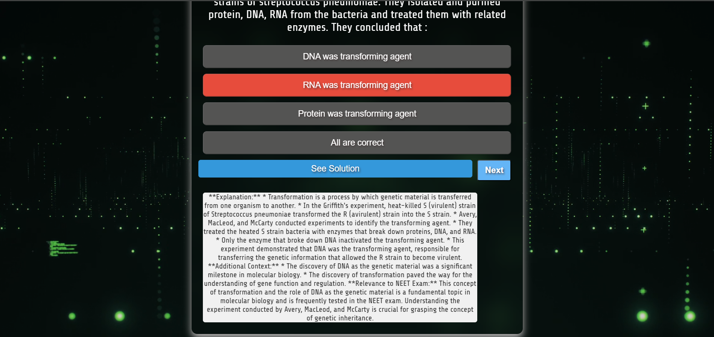

# QuizzApp

## Overview
QuizzApp is an interactive web-based quiz application designed to challenge users' knowledge with various questions and gamification elements. It offers a dynamic user interface, incorporating background videos and smooth transitions for a better user experience. The application allows users to attempt a quiz, view the results, and even see detailed solutions to the questions.

## Features
- **Interactive Quiz**: Users can select answers for multiple-choice questions.
- **Real-Time Scoring**: The score updates instantly after each question.
- **Gamification**: Includes congratulatory messages for correct answers and error messages for incorrect ones.
- **Solution View**: After answering a question, users can view detailed solutions.
- **Background Video**: The app uses background videos to enhance user experience.
- **Progressive UI**: Smooth fade-in and fade-out transitions between questions.

## Prerequisites
Before you begin, ensure that you have met the following requirements:

- Node.js (preferably the latest version)
- npm (Node Package Manager)
- Backend Server (Optional, for fetching quiz data from an API)

## Installation
Follow the steps below to set up the project locally:

### Clone the Repository
```bash
git clone https://github.com/Satyam-Singh1/QuizzApp.git
```
### Navigate to the Frontend Directory
```bash
cd QuizzApp/Frontend/project1

```
###Install Dependencies
```bash
npm install

```
## Backend Setup
To fetch quiz data from a local API, ensure that you have the backend server running. Follow the steps below:

### Navigate to the Backend Directory
```bash
cd QuizzApp/Server
```
### Run the server
```bash
node index.js
```
## Watch the video demo 
[Watch the Demo Video](Frontend/project1/src/assets/DemoVideo.mp4)

## Welcome to the Quiz App





